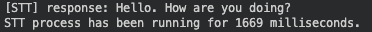
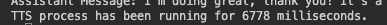
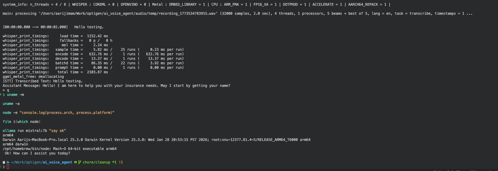

# Technical Documentation

## 1. Case study alignment

This project is built in TypeScript and runs as a CLI voice agent.
It covers the required insurance intents and includes a full voice pipeline.
English and German both are supported.
The architecture is modular and each stage logs timing in milliseconds.

### Requirement status

- Voice pipeline from audio input to spoken output is implemented.
- Intent system with policy_enquiry report_claim schedule_appointment and unknown fallback is implemented.
- Session memory keeps conversation context and customer name in the same session.
- Session reset is implemented on quit.
- Cross session memory is implemented with JSON files in **data/memory** and **data/summaries**.

## 2. System architecture

The application runs as a sequential pipeline.

### Flow

1. User gives input from microphone or audio file.
2. Audio is captured or loaded.
3. Speech to text converts audio to transcript.
4. Agent adds transcript to current session history.
5. Prompt builder creates a structured instruction with context.
6. LLM returns JSON with intent and spoken response text.
7. Intent detector parses JSON and applies fallback if parsing fails.
8. Session updates intent customer name and history.
9. Text to speech plays the assistant response.
10. Session summary is generated and stored when session ends.

### Components

#### **src/index.ts**
Starts CLI and handles commands r f l q, also asks the user's phone number on start to identify
- This can be a good identifies in actual cases as user will be calling from his phone

#### **src/agent.ts**
Main orchestrator for audio processing text processing intent handling and speech output.
- Takes the audio and does the necessary processing on it pipeline is called here STT->LLM->TTS

#### **src/pipeline/audio.ts**
Handles microphone recording and audio conversion.
- Uses sox to record audio and contains ffmpeg call to convert if needed.

#### **src/pipeline/stt.ts**
Runs Whisper transcription through nodejs whisper.
- This is a wrapper for whispercpp which is cpp implementation for whisper and supports accelerated inference on Apple Silicon, later we can fork and modify this library too for our need, specially realtime transcription can speed up the process.

#### **src/pipeline/llm.ts**
Runs LLM inference calls.
- Has two options based on config: Ollama (default) or Gemini (optional).
- Local Ollama is now the default provider in config for faster local-first development.
- Response format is enforced with Zod schemas passed to Ollama `format` (converted using `zod-to-json-schema`) to improve JSON reliability.
- For Gemini model
  - I chose the "gemini-3.1-flash-lite-preview" because it is the latest flash lite model as we don't need that much context and designing for least latency a faster smaller model is better.
  - I chose Gemini in particular because it offers a free api for developers for testing, in our case as we are not using media, or complex calculations the choice of models do not matter that much, I also tested with "gemini-3-flash-preview" and there was not much difference as we are also use limited tokens and sentence length.
- For Local LLM (Ollama)
  - Choice first of all depended on the amount of RAM I had, being limited by 16 GB VRAM, I was limited to using the smaller parameter versions of the models.
  - I tested will llama3.2:1b (1 billion params) with zod format, the output was reliable but llm tended to hallucinate and forget information sometimes.
  - I test wth llama3.2:3b (3 billion params) the output was more reliable and the speed difference between 1b and 3b was minimal (can be seen in latency report). - This was chosen for best speed/output quality ratio.
  - Mistral:7b was able to provide reliable results as well as maintain a larger amount of context, it also seemed to reply with the correct structure most of the times, this was also the biggest model in param sizes, so the quality of output was naturally better, but the response were slower compared to the smalller llama models.

#### **src/pipeline/tts.ts**
Uses macOS say for voice response.
- As we sticking to only Apple Silicon macOS say was the fastest and easiest ooption to implement, it supports voices in both English and German and the latency is very minimum and can run on any mac, however the audio quality is not ideal.
- As I wanted to stick to local models, ElevenLabs or OpenAI TTS were not an option for me as those are paid APIs, however opensource TTS models do exists and I have also worked with some of these models before,  in the future if we want to run it locally we can use Chatterbox, Qwen, XTTS etc

#### **src/conversation/prompts.ts**
Builds prompt templates for English and German and enforces strict JSON response shape.
- Initially I was thinking of having two separate prompts for intent detection and response but that would lead to a few problems.
  - User might try to change intent mid conversation, User might not clearly state his intent until later
  - If we also wanted to detect the change in intent, we would have to run two llm inference which would add to the latency.
- I decided on uses a hybrid approach where I am using only one sytem prompts, which is built each time using the current intent and name of the customer, and also watches for change in intent from the user, this way I was able to provide specific instructions for each other as well watch for a change in intent.
- I also wanted to keep the size of the system prompt small because I was using small local models, when using online apis we can use more complex and detailed prompts as well.
- For designing the prompt my approach was to use JSON to extract intent and change in intent, I also wanted to provide specific instructions based on the current intent, I started designing the prompt as follows:
  1. Start by defining strict JSON structure
  2. Telling the LLM what it is "a helpful insurance agent"
  3. Defining what each intent means and giving examples
  4. Appending specific sample instructions for current intent
  4. Using the customer's name and asking it if not known.
  5. Defining Intent switching rules.
  6. Adding previous context and how to use it.
- There are two versions one in English and one in German

#### **src/intents/detector.ts**
Runs intent detection and JSON repair fallback.
- Uses the prompt to infer the LLM and parse the JSON response from the LLM

#### **src/intents/handler.ts**
Routes intent specific logic.
- These are placeholder functions, specific actions based on the intent can be performed here once the necessary information has been retrieved from the user.

#### **src/memory/session.ts**
Stores in session conversation history and customer name, and other user and session details.

#### **src/memory/memory.ts**
Persists session records to JSON files.
- Store the entire chat log into a json file for each user, this is not used currently but is stored for future use and logs.

#### **src/memory/summary.ts**
Generates and stores session summaries for continuity.
- Uses the LLM to summarize the chat history of the current session into a smaller version with all the important and relevant information, this summarized version is then injected into future prompts for context

#### **src/utils/config.ts**
Central config for models language and audio settings.
- Defines settings for whisper, gemini, ollama, tts and audio recorder (more details in README.md)

## 3. Setup and run instructions

Detailed setup is in **README.md**.

### Quick run

- Install system tools on macOS.
  brew install ffmpeg sox
- Install dependencies.
  npm install
- Set API key if Gemini provider is active.
  export GEMINI_API_KEY="your_api_key_here"
- Build project.
  npm run build
- Start app.
  npm run start

### CLI commands

- r <seconds>
  Record microphone audio and process it.
- f <filename>
  Process an existing audio file from audio folder.
- l <en|de>
  Switch language and voice.
- q
  End session and save memory plus summary.

## 4. LLM STT TTS choices and justification
### LLM choice

- Also explained in detail in the **llm.ts** section of this doc 

- Default provider is Ollama (`llm.provider = "local"`) for local-first execution and reduced cloud dependency.
- Structured JSON output is now constrained with Zod-based format definitions, which improves parsing reliability.
- Gemini remains available as an optional provider when cloud inference is needed.

### STT choice

- Whisper medium (to save ram) is used via nodejs whisper.
        - More specific whisper models exists for english and german, but loading and unloading models adds overload, add will also need to modify the nodejs-whisper library to support custom models for german.
- It gives stable transcription quality for conversational audio.
- It supports multilingual use which helps for English and German scenarios.

### TTS choice

- More details are also provided in the **tts.ts** section of this doc.

- macOS say is used because the case study target environment is Apple Silicon macOS.
- Setup is simple and local with no extra cloud dependency.
- This supports fast prototyping and low integration overhead.

## 5. Prompt design and version notes
### Design goals

- More details mentions in **prompts.ts** section of this doc.

- Keep assistant responses short for voice playback.
- Enforce strict JSON output for reliable parsing.
- Enforce schema-constrained JSON format through Zod for stronger output consistency.
- Support active task continuity and intent switch handling.
- Ask for customer name when missing and reuse it later.
- Support English and German prompt variants.

### Current JSON schema used by the agent

- intent
- intentSwitch
- abandonPrevious
- confidence
- customerName
- llm_response

### Prompt evolution

- Version 1
  Basic intent classification.
- Version 2
  Strict JSON only output requirement.
- Version 3
  Voice friendly response length control.
- Version 4
  Session continuity with previous summary context.
- Version 5
  English and German templates with intent specific instructions.

## 6. Task 2 intent handling behavior
### Implemented intents

- policy_enquiry
- report_claim
- schedule_appointment
- general_conversation
- unknown

### Fallback behavior

- If model output cannot be parsed as JSON then the detector returns unknown (with JSON repair fallback first).
- The agent responds with a safe fallback message asking the user to rephrase.

## 7. Task 3 memory and context behavior
### In session memory

- Conversation history is stored turn by turn.
- Customer name is captured and reused in later turns.
- Current intent is tracked and updated during conversation.

### Session end behavior

- On q command the session is ended.
- The session is persisted to **data/memory**.
- A summary is generated via llm and saved to **data/summaries**, this is used in future session.
- A new clean session object is created.

### Cross session memory bonus

- Previous session summaries are loaded as context for the same user key.
- User key can be phone based or anonymous UUID.

## 8. Latency logging evidence

The code logs elapsed time for key stages in milliseconds and persists per-turn benchmark rows to CSV.

### CSV benchmark output

- File path: **data/benchmarks/latency.csv**
- Row granularity: one row per processed interaction (microphone or file input)
- Columns:
  - timestamp
  - sessionId
  - userKey
  - llmProvider
  - llmModel
  - inputSource
  - sttMs
  - llmMs
  - ttsMs
  - totalMs
  - status

### Logged stages

- STT timer in **src/pipeline/stt.ts**
- LLM timer in **src/pipeline/llm.ts**
- TTS timer in **src/pipeline/tts.ts**

### Brief latency results (latest benchmark sample)

| Metric | Value |
| --- | --- |
| Source | **data/benchmarks/latency.csv** |
| Sample size | **39** interactions |
| Status split | **38 ok**, **1 error** |
| Avg `sttMs` | 1811 |
| Avg `llmMs` | 3051 |
| Avg `ttsMs` | 7023 |
| Avg `totalMs` | 11888 |
| Observation | **TTS is the largest stage** (~59% of average total latency) |

| Provider | Model | n | Avg `llmMs` | Avg `totalMs` |
| --- | --- | ---: | ---: | ---: |
| ollama | `llama3.2:3b` | 24 | 2864 | 11359 |
| ollama | `llama3.2:1b` | 3 | 3025 | 13983 |
| ollama | `mistral:7b` | 5 | 7032 | 15365 |
| gemini | `gemini-3.1-flash-lite-preview` | 7 | 860 | 10318 |

- **IMPORTANT:** `ttsMs` includes the full time required for TTS to speak the complete sentence, and `totalMs` also includes this complete TTS speaking duration.
- **NOTE:** Because local models are used in this project path (local Whisper and optional local LLM via Ollama), measured latency is highly dependent on model size, Apple Silicon hardware capability, and current machine load.
- **NOTE:** The first inference in each fresh run is expected to be slower because of model/runtime loading (cold start). After warm-up, subsequent inferences are generally faster.

- These times can be improved significantly by using realtime inference to models
  - Whisper and XTTS both have realtime libraries for python , but will these to modify some libraries and look into greater depth for Typescript.
- These times are be greatly reduced by using better hardware for faster inference speeds and better models.

## 9. Apple Silicon compliance

This project is intended to run on Apple Silicon Mac.
It uses macOS native speech command and was tested on M series hardware.

### Evidence

## 10. Libraries used

### Project dependencies from package.json

- **@google/genai**
  - Purpose: Gemini API client for cloud LLM inference.
  - Used in **src/pipeline/llm.ts** for chat creation and response generation when provider is set to Gemini.

- **ollama**
  - Purpose: Local LLM client for running models through Ollama.
  - Used in **src/pipeline/llm.ts** as local inference option.

- **zod**
  - Purpose: Define runtime schema for LLM response format.
  - Used in **src/intents/types.ts** and passed to **src/pipeline/llm.ts** for schema-based output constraints.

- **zod-to-json-schema**
  - Purpose: Convert Zod schema into JSON Schema for Ollama `format` parameter.
  - Used in **src/pipeline/llm.ts** to enforce structured response output.

- **nodejs-whisper**
  - Purpose: TypeScript friendly wrapper to run Whisper transcription.
  - Used in **src/pipeline/stt.ts** for speech to text transcription.

- **whisper.cpp**
  - Purpose: Base Whisper runtime dependency used by nodejs-whisper.
  - Used indirectly through **nodejs-whisper** for local STT execution.

- **@types/node** (dev dependency)
  - Purpose: Node.js TypeScript type definitions.
  - Used during development and build time for type safety across Node APIs.

### System tools used by the pipeline

- **sox**
  - Purpose: Microphone audio capture.
  - Used in **src/pipeline/audio.ts**.

- **ffmpeg**
  - Purpose: Audio conversion to pipeline compatible WAV format.
  - Used in **src/pipeline/audio.ts**.

- **macOS say**
  - Purpose: Native text to speech output.
  - Used in **src/pipeline/tts.ts**.

### Node.js built in modules used

- **child_process**
  - Used for calling system tools and TTS.
- **fs** and **path**
  - Used for file handling and storage paths.
- **crypto**
  - Used for session or user identifiers.
- **readline** and **url**
  - Used for CLI interaction and runtime path handling.

## 11. Known limitations and improvements

### Known limitations

- Intent handler business logic is mostly simulated.
- Security hardening and authentication are not implemented.
- Cannot run better models locally due to RAM limitations
- No realtime inference library for whisper or TTS for local models on node
- No hard checks for LLM actions in place.

### Suggested improvements

- Connect intents to real insurance backend services.
- Expand schema validation coverage for additional response types.
- Add automated tests for prompt parsing and memory transitions.
- Use realtime inference for AI Models.
- Use custom models for english and german (reduce size of models)
- Use a better more naturally sounding TTS
- Add more extreme edge cases and error handles

## 12. AI usage summary

A separate declaration file is provided in **AI_USAGE.md**.
That file explains where AI was used and where manual work was done.
